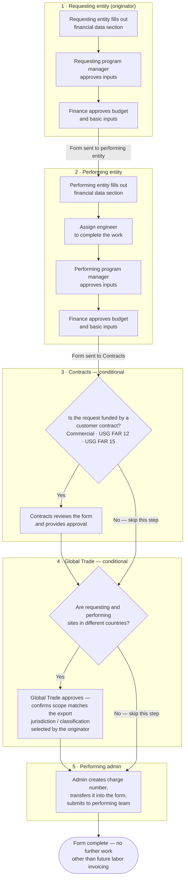

# Work authorization process flow

The routing and approval sequence an internal work authorization (IWA) moves through today.
This is the process the system we are building has to facilitate — the reference point every
capability decision is measured against.

**Source.** Transcribed by hand from a working reference document supplied by the process
owner. That document is not in this repository and never will be: it is sensitivity-labelled
and carries proprietary content. See the *Transcription notes* at the end for exactly what was
changed in transcription.

**Status.** This records the process as it stands. It is deliberately *not* a proposal. Which
steps a future system preserves, merges, automates, or removes is an open question and belongs
in a decision record, not here.

**Corrections.** The description of the reference chart in *The manual lookup problem* was
corrected on 2026-09-10, after the source workbook was inspected directly for the first time.
It previously described a single four-level hierarchy with one colour encoding. That was this
document's own inference from the form's field names, not a transcription of the source, and
it was wrong on both counts.

## The flow

## Reading the flow

The form is a **relay**. It originates with the requesting entity, is handed to the performing
entity, passes through up to two conditional compliance gates, and terminates with an
administrator who mints the charge number. No stage begins before the previous one closes.

**Four approvals are mandatory** — a program manager and a finance approver on each side.
**Two more are conditional**, so a cross-border request funded by a customer contract clears
six sequential gates. The charge number, which is what the performing team actually needs in
order to book time, is created at the very last step. Nothing downstream can start until every
gate upstream has cleared.

The two conditional gates test different things and are independent of each other:

| Gate | Condition | Concern |
|---|---|---|
| Contracts | The work is funded by a customer contract (Commercial, USG FAR 12, USG FAR 15) | Whether the authorization is consistent with the funding contract's terms |
| Global Trade | Requesting and performing sites are in different countries | Whether the scope matches the export jurisdiction and classification the originator selected |

## Inputs the form collects

Both entities supply a near-identical block. The performing side adds the four fields that
describe the work being done and who books it.

| Input | Requesting | Performing | Source |
|---|:--:|:--:|---|
| Group selection | ● | — | Manual lookup |
| CAS group | ● | ● | Manual lookup |
| CAS segment | ● | ● | Manual lookup |
| CAS SBU | ● | ● | Manual lookup |
| Legal entity | ● | ● | Manual lookup |
| Location type (domestic or international) | ● | ● | Entered |
| Trading partner number | ● | ● | Entered |
| Location | ● | ● | Entered |
| Finance / ERP entity code | ● | ● | Entered |
| Billing point of contact | ● | ● | Entered |
| Program manager | ● | ● | Entered |
| Finance approver | ● | ● | Entered |
| Employee performing the work | — | ● | Entered |
| Budget hours and labor rate | — | ● | Entered |
| G&A % (if applicable) | — | ● | Entered |
| Charge number admin | — | ● | Entered |

### The manual lookup problem

The nine fields marked **manual lookup** are the ones the source document highlights in red,
with the note that they *"come from special company chart but must be manually analyzed and
entered by the user."*

That chart is not one chart. It is three, held as separate tabs of a spreadsheet whose entire
content is embedded screenshots. The three share no layout and no code scheme — one arranges
segments as columns, one is a bracket tree grouped by function, one is a flat list — so a
user must first know which of the three to open. Nothing on the form tells them. Each supplies
three levels, chart → segment → unit, where the unit is the leaf carrying the legal entity,
its cost center codes, and its disclosure treatment.

Each leaf also carries a foreign-entity marker, a disclosure-statement type, and footnoted
exceptions. Three of those attributes are conveyed by colour alone, on three independent
channels: fill gives the disclosure-statement type, text colour marks a foreign entity, and
the ink colour of an individual cost center code marks that code as shared with another
segment. The chart carries no legend for any of them. There is no machine-readable data in it.

A further trap: a cost center code does not identify a unit. Several units can share one code,
and two units can share an identical set of codes while carrying different disclosure
treatments.

So filling in the CAS block means a person choosing among three differently-shaped charts,
visually parsing a picture of an org chart, decoding three unlabelled colour channels, and
hand-transcribing the result — on **both** sides of every form. This is the single largest
source of manual effort and transcription error in the process as it stands.

## Discrepancies in the source document

Recorded as found, not corrected, so the transcription stays faithful. Each needs confirming
with the process owner.

1. **The performing entity's legal-entity field is labelled "Requesting Legal Entity"** — the
   same string as the requesting block. Almost certainly a copy-paste error for *Performing*
   Legal Entity, but it is what the source says.
2. **The stage numbering runs 1, 2, 3, 4, 4, 5** — Global Trade and Performing Admin are both
   numbered 4. This document renumbers them 4 and 5, and the completion state is shown as a
   terminator rather than a numbered stage.
3. **The export jurisdiction / classification has no input field.** Global Trade's step
   validates a classification *"selected by the originator,"* but no such field appears in the
   inputs list. Either the list is incomplete or that selection happens outside this form.
4. **The Contracts gate names three funding types but no routing difference between them.**
   Whether Commercial, FAR 12, and FAR 15 follow the same review path is not stated.

5. **The form asks for four lookup levels; the chart supplies three.** The inputs list marks
   CAS group, CAS segment, CAS SBU, and legal entity as manual lookup — four levels. The
   chart resolves only to chart → segment → unit, and its leaf is inconsistent about whether
   it names an SBU or a legal entity: some leaves are legal names with corporate suffixes,
   others are
   function descriptions. Which form field each chart level answers, and what fills the gap, is
   open — see issue #16.

## Transcription notes

Per the repository's data-handling rules, the following were changed in transcription. Nothing
else was altered; the step sequence, gate conditions, and decision wording are as written in
the source.

- **Internal system names were genericised.** Two input fields named specific internal
  platforms; they appear here as *trading partner number* and *finance / ERP entity code*.
- **No entity names, cost center codes, CAGE codes, or site locations were carried over.** The
  source flowchart contained none; the accompanying spreadsheet contained many, and none of it
  is reproduced here or anywhere in this repository.
- **The employee named as the document's author is not recorded.**
